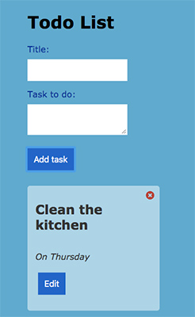
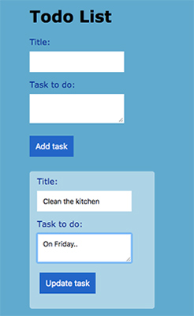

## Todo List

This is a simple todo list built in React where you can add, edit and remove your todo tasks.

 

### Example User stories

- **Create todo** As a user I want to create a new todo/task with `title` and `body` and save it in the database.
- **List todos** As a user I want to see all my todos in a list.
- **Delete todo** As a user I want to delete a todo from the list when I don't want it anymore.
- **Update todo** A a user I want to be able to modify an existing todo.

### Backlog

- **Done** As a user I want to mark my todo as done.
- **Move todos** As a user I want to rearrange my todos.

### Backend

Express and Mongo backend [here](https://github.com/ansolantz/challenge-todo-api) 

### 

